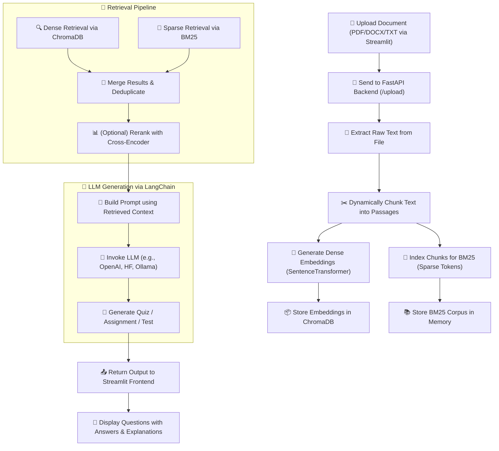
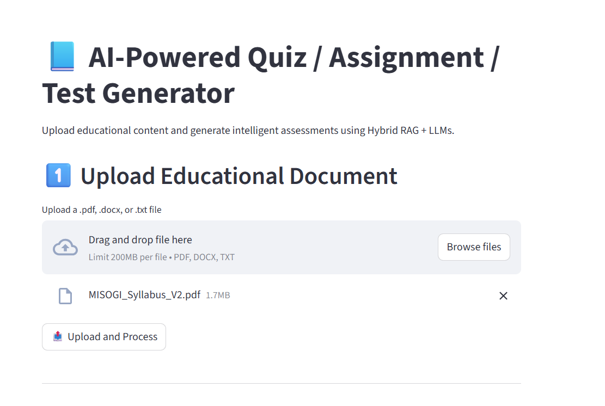
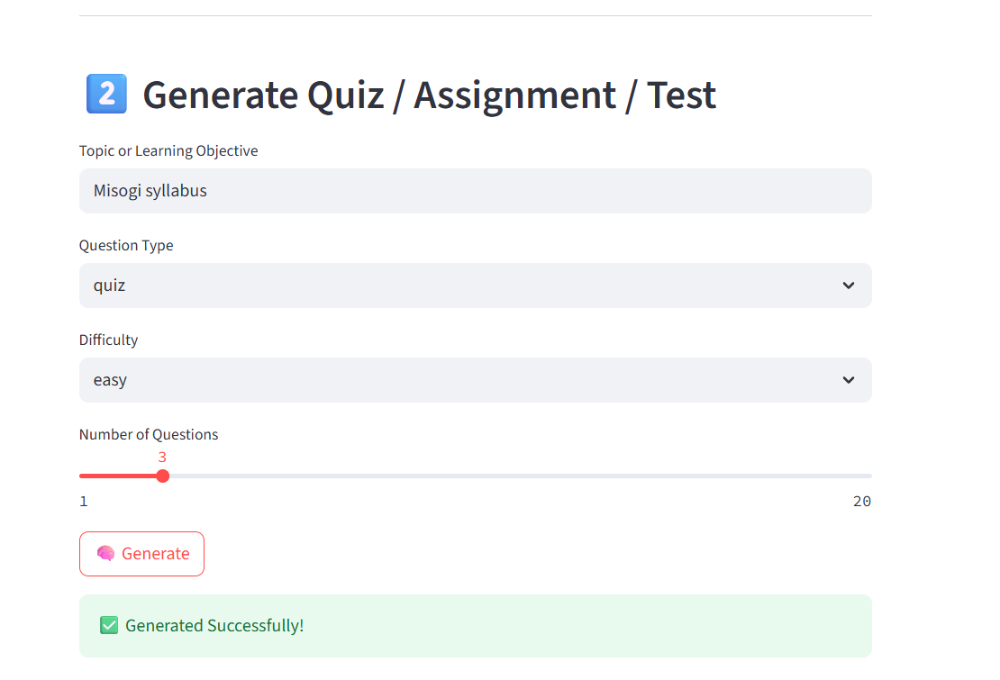
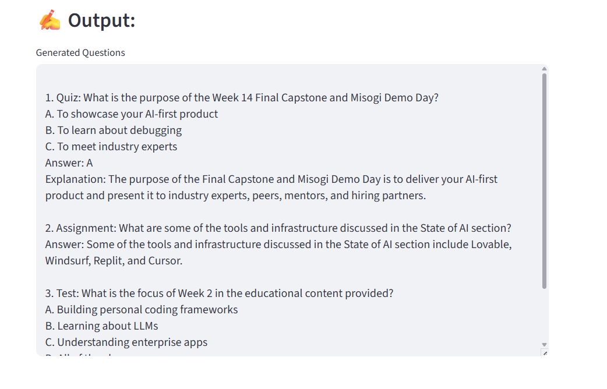

# 🤖 Automated Quiz Generator

An AI-powered system that allows educators to upload course material and generate **quizzes**, **assignments**, and **tests** using **Hybrid Retrieval-Augmented Generation (RAG)** with **LangChain** and **LLMs**.


## 🌟 Features

- Upload educational documents (`.pdf`, `.docx`, `.txt`)
- Hybrid RAG: Combines dense (Sentence Transformers) and sparse (BM25) retrieval
- Dynamic chunking and compression
- LangChain + LLMs for question generation
- Generates MCQs, open-ended questions, and mixed tests
- Difficulty levels: Easy, Medium, Hard
- Clean and interactive UI with Streamlit


## 🚀 How It Works




## 🖼️ UI Preview

Here’s what the app looks like in action:

### 📤 Upload Section

Upload educational documents (`.pdf`, `.docx`, `.txt`)




### 🧠 Generation Form

Select question type, difficulty, number of questions, and topic




### 📝 Output Viewer

Generated quiz, assignment, or test shown in a clean textbox




## 🧱 Folder Structure

```

Automated_Quiz_Generator/
├── backend/
│   ├── main.py              # FastAPI app entry point
│   ├── processing.py        # File parsing, chunking, and embedding
│   ├── rag_engine.py        # Hybrid RAG logic (BM25 + dense + rerank)
│   ├── quiz_generator.py    # LangChain-based quiz generation
│
├── frontend/
│   └── app.py               # Streamlit user interface
│
├── data/
│   └── uploaded_docs/       # Uploaded files stored here
│
├── vector_db/               # (Optional) ChromaDB persistent storage
│
├── requirements.txt         # Dependencies
└── README.md                

```

# 🧠 Tech Stack

This project combines modern NLP tools, vector databases, and LLM orchestration frameworks to build a hybrid RAG-based quiz/assignment generator.


## ⚙️ Technologies Used

| **Area**           | **Tech**                              |
|--------------------|----------------------------------------|
| 🖥️ Backend         | [FastAPI]() - High-performance web API framework |
| 🎛️ Frontend        | [Streamlit]() - Interactive app builder for ML/data apps |
| 🔡 Embeddings       | [sentence-transformers]() - Dense vector representations |
| 🧮 Sparse Search    | [BM25]() (`rank_bm25`) - Lexical retrieval |
| 🧠 Vector Store     | [ChromaDB]() - Lightweight and persistent vector DB |
| 🔗 LLM Integration  | [LangChain]() + [OpenAI]() - RAG & question generation |
| 📄 PDF Parsing      | [PyPDF2]() / [pdfplumber]() - Text extraction from PDFs |
| 📃 DOCX Support     | [python-docx]() - Extract text from `.docx` files |
| 🚀 Deployment       | [Uvicorn]() - ASGI server to run FastAPI |


## 🚀 How to Run This Application

Follow these steps to get the backend and frontend running locally.

### ✅ 1. Clone the Repository

```bash
git clone https://github.com/ravin1100/w5d3_Advanced_RAG_techniques.git

cd ./q1/Automated-Quiz-Generator

```

### ✅ 2. Create & Activate Virtual Environment

```bash
# Create a virtual environment
python -m venv venv

# Activate the environment

# On Windows:
.\venv\Scripts\activate

# On macOS/Linux:
source venv/bin/activate

```

### ✅ 3. Install Requirements

```bash
pip install -r requirements.txt
```

### ✅ 4. Run the FastAPI Backend

```bash
uvicorn backend.main:app --reload
```
This will start the backend server on:
📍 http://localhost:8000

### ✅ 5. Run the Streamlit Frontend
Open a new terminal (while backend is still running):

```bash
streamlit run frontend/app.py
```
The frontend will open at:
🌐 http://localhost:8501

### ✅ 6. Upload a Document and Generate Quiz

- Drag and drop a .pdf, .docx, or .txt file.

- Choose the question type and difficulty.

- Click Generate to get questions powered by LLM + Hybrid RAG.

